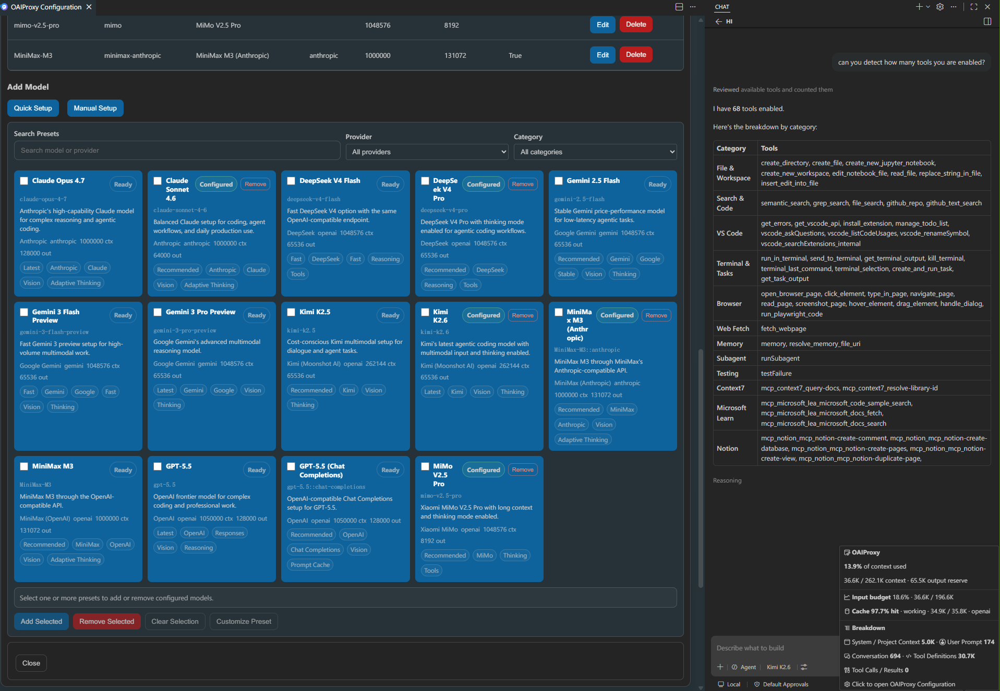
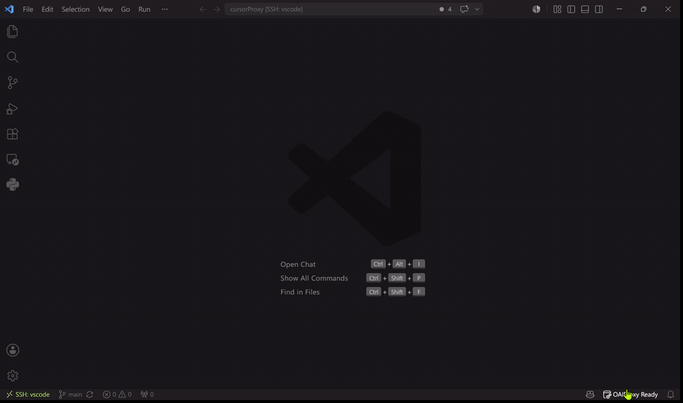

<div align="center">


# OAIProxy

**A self-maintained VS Code extension to use OpenAI/Ollama/Anthropic/Gemini API providers in GitHub Copilot Chat, with presets for OpenAI, Anthropic, Kimi, DeepSeek, Xiaomi MiMo, and MiniMax** 🔥

English | [简体中文](README.zh-CN.md)

</div>

[](https://github.com/lqdflying/OAIProxy/blob/main/LICENSE)





## Features
- **Multi-API support**: OpenAI/Ollama/Anthropic/Gemini APIs, with OpenAI-compatible presets for Kimi, DeepSeek, Xiaomi MiMo, MiniMax, ModelScope, SiliconFlow, and more
- **Vision models**: Full support for image understanding capabilities
- **Vision Bridge**: Use images in chat with text-only models — OAIProxy automatically describes images via a configured vision model with LRU caching
- **Think tag support**: Seamless display of model thinking/reasoning blocks across all providers (OpenAI, Ollama, Gemini, Anthropic)
- **Thinking Effort control**: VS Code's built-in per-model Thinking Effort dropdown in the model picker — customize reasoning effort on the fly
- **Advanced configuration**: Flexible chat request options with thinking/reasoning control
- **Multi-provider management**: Configure models from multiple providers simultaneously with automatic API key management
- **Provider usage checks**: Check DeepSeek/Kimi credit balance, MiniMax token-plan remaining quota, and OpenAI/Anthropic month-to-date cost usage from a standalone Provider Usage Check table; MiMo is shown as unavailable until Xiaomi publishes a public API-key usage endpoint
- **Multi-config per model**: Define different settings for the same model (e.g., GLM-4.6 with/without thinking)
- **Visual configuration UI**: Intuitive interface for managing providers and models
- **Auto-retry**: Handles API errors (429, 500, 502, 503, 504) with exponential backoff
- **Request cancellation**: Stop in-progress chat requests instantly — cancellation is wired to HTTP `AbortController` across all API modes
- **Token usage**: Real-time token counting and provider API key management from status bar
- **Git integration**: Generate commit messages directly from source control with OpenAI/OpenAI Responses/Ollama/Anthropic models
- **Import/export**: Easily share and backup configurations
- **Tools optimization**: Optimize agent `read_file` tool handling for supported streamed tool calls, avoiding small chunks for large files.
- **Structured logging**: File-based request/debug logs with rotation, configurable levels (`off`/`debug`/`info`/`warn`/`error`)

## Requirements
- VS Code 1.120.0 or higher.
- OpenAI-compatible provider API key.

## Quick Start
1. Install the OAIProxy VSIX package (`lqdflying.oaiproxy`).
2. Open VS Code Settings and configure `oaicopilot.baseUrl` and `oaicopilot.models`.
3. Open GitHub Copilot Chat interface.
4. Click the model picker and select "Manage Models...".
5. Choose "OAIProxy" provider.
6. Enter your API key — it will be saved locally.
7. Select the models you want to add to the model picker.

> Compatibility note: OAIProxy keeps the existing `oaicopilot.*` settings keys, so your JSON model configuration stays valid. Because the extension ID changed to `lqdflying.oaiproxy`, VS Code may require entering API keys once under the new extension.

### Settings Example

```json
"oaicopilot.baseUrl": "https://api-inference.modelscope.cn/v1",
"oaicopilot.models": [
    {
        "id": "Qwen/Qwen3-Coder-480B-A35B-Instruct",
        "owned_by": "modelscope",
        "context_length": 256000,
        "max_tokens": 8192
    }
]
```

## Configuration UI

The extension provides a visual configuration interface for managing providers, models, and API keys without editing JSON files manually. Open via the Command Palette (`OAIProxy: Open Configuration UI`) or click the OAIProxy status bar item.

The Provider Management form includes presets for OpenAI, Anthropic, Kimi, DeepSeek, Xiaomi MiMo, and MiniMax. Selecting a preset fills the provider ID, base URL, and API mode; you still choose the model ID from the provider's current documentation or model list. Example snippets are in `examples/openai-responses.jsonc`, `examples/openai-chat-completions.jsonc`, `examples/anthropic.jsonc`, `examples/mimo.jsonc`, `examples/minimax-openai.jsonc`, and `examples/minimax-anthropic.jsonc`.

The standalone Provider Usage Check table lists configured supported providers dynamically and reports credit, token-plan, or cost usage. OpenAI and Anthropic usage/admin keys are stored separately from chat API keys. MiMo entries are shown with an unavailable reason because Xiaomi currently exposes balance and usage through Console pages, not a documented public API-key endpoint.

→ [Full Configuration Guide](doc/configuration.md)

## Multi-API Mode

Supports five API protocols: `openai` (Chat Completions), `openai-responses` (Responses), `ollama`, `anthropic`, and `gemini`. Specify per-model via the `apiMode` parameter.

Kimi, DeepSeek, and Xiaomi MiMo use the existing `openai` mode because their hosted APIs are OpenAI-compatible. MiniMax supports both `openai` and `anthropic` modes; MiniMax recommends the Anthropic-compatible M3 endpoint for thinking and interleaved-thinking workflows.

→ [Full Multi-API Guide](doc/configuration.md#multi-api-mode)

## MiniMax M3

Use `MiniMax-M3` as the model ID. MiniMax's M3 docs list a 1,000,000-token context window, tool use, coding/agentic workflows, adaptive thinking, and native image/video input. OAIProxy supports M3 through the existing MiniMax OpenAI-compatible preset (`https://api.minimax.io/v1`) and MiniMax Anthropic-compatible preset (`https://api.minimax.io/anthropic`).

For OpenAI mode, use `max_completion_tokens`, `thinking: { "type": "adaptive" }`, and `extra.reasoning_split: true` to stream thinking separately. For Anthropic mode, use `max_tokens` and `thinking: { "type": "adaptive" }`. Set `vision: true` for M3 so OAIProxy forwards image and supported video `LanguageModelDataPart`s directly instead of routing image inputs through Vision Bridge.

## Vision Bridge

Use images with text-only models. OAIProxy automatically describes images via a configured vision-capable model before forwarding as text, with LRU caching (50 entries, ~500KB).

→ [Vision Bridge Guide](doc/vision-bridge.md)

## Multi-Provider Guide

Configure models from multiple providers simultaneously. Use `owned_by` to group models by provider, with automatic per-provider API key management stored as `oaicopilot.apiKey.<provider>`.

→ [Multi-Provider Guide](doc/configuration.md#multi-provider-guide)

## Multi-config for the same model

Define multiple configurations for the same model ID via `configId` (e.g., `glm-4.6::thinking` and `glm-4.6::no-thinking`), each with independent settings.

→ [Multi-config Guide](doc/configuration.md#multi-config-for-the-same-model)

## Thinking Effort Control

VS Code 1.120+ exposes a per-model Thinking Effort dropdown in the model picker. Enable it with `supports_reasoning_effort: true`. DeepSeek models default to `high`/`max`; Claude Sonnet 4.6 is detected automatically and maps to Anthropic `output_config.effort`.

→ [Thinking Effort Guide](doc/thinking-effort.md)

## Custom Headers

Specify custom HTTP headers per model provider (API versioning, additional auth, debugging tokens). Merged with default headers on each request.

→ [Custom Headers Guide](doc/custom-headers.md)

## Custom Request Body Parameters

Use the `extra` field to inject arbitrary JSON parameters into the API request body for all API modes. Override standard parameters or add provider-specific features.

→ [Custom Request Body Guide](doc/custom-request-body.md)

## Prompt / KV Cache

OAIProxy surfaces provider cache-hit usage in structured logs and applies safe cache request shaping where supported. OpenAI endpoints get a stable `prompt_cache_key` by default, while Anthropic-compatible `cache_control` writes are opt-in via `prompt_cache.anthropic.enabled` or explicit VS Code `cache_control` message parts. DeepSeek, Xiaomi MiMo, MiniMax OpenAI mode, and Gemini continue to use provider automatic/implicit caching.

OpenAI `previous_response_id` is kept for conversation state only; OpenAI still bills previous input tokens in the response chain. Use `oaicopilot.logLevel: "info"` or `"debug"` and inspect `cache.usage` log entries to verify actual cache reads/hits.

## Model Parameters

Full reference of all 30+ configurable model parameters (`id`, `owned_by`, `temperature`, `reasoning_effort`, `vision`, `toolCalling`, `apiMode`, etc.).

→ [Model Parameters Reference](doc/model-parameters.md)

## Logging

OAIProxy always writes extension lifecycle events (install, update, activate) to the VS Code Output panel. Open `Output: Show Output` and select `OAIProxy`.

For request/debug logs, add this to VS Code User Settings JSON:

```json
"oaicopilot.logLevel": "debug"
```

Valid values are `off`, `debug`, `info`, `warn`, and `error`. File logs are written to `~/.copilot/oaiproxy/logs/` with daily rotation (logs older than 7 days are automatically cleaned up). Sensitive header values (`Authorization`, `x-api-key`, `x-goog-api-key`) are automatically redacted from log output.

## Thanks to

Thanks to all the people who contribute.

- [Contributors](https://github.com/lqdflying/OAIProxy/graphs/contributors)
- [Hugging Face Chat Extension](https://github.com/huggingface/huggingface-vscode-chat)
- [VS Code Chat Provider API](https://code.visualstudio.com/api/extension-guides/ai/language-model-chat-provider)

## Support & License
- Open issues: https://github.com/lqdflying/OAIProxy/issues
- License: MIT.
- Original upstream copyright (c) 2025 Johnny Zhao; OAIProxy changes copyright (c) 2026 lqdflying.
