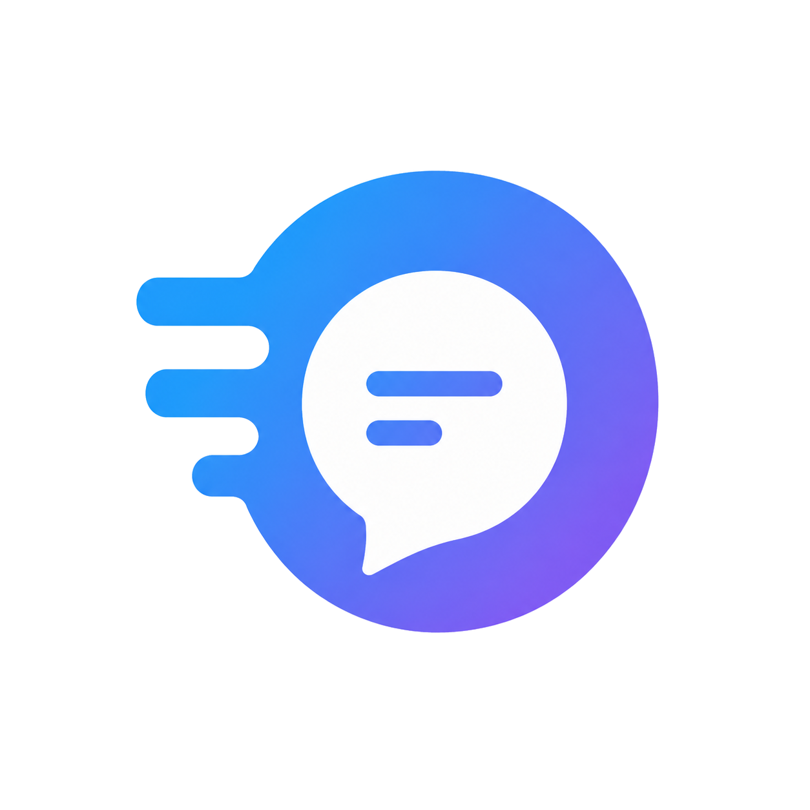
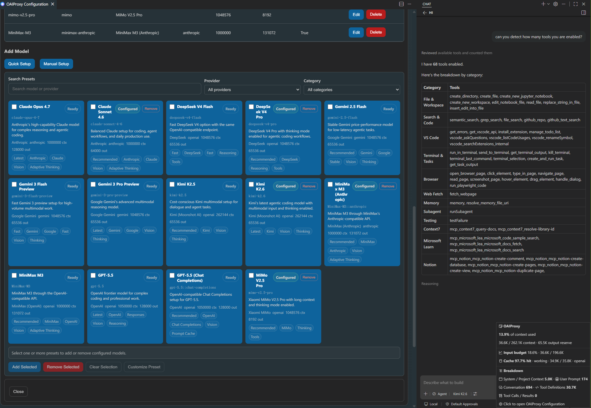
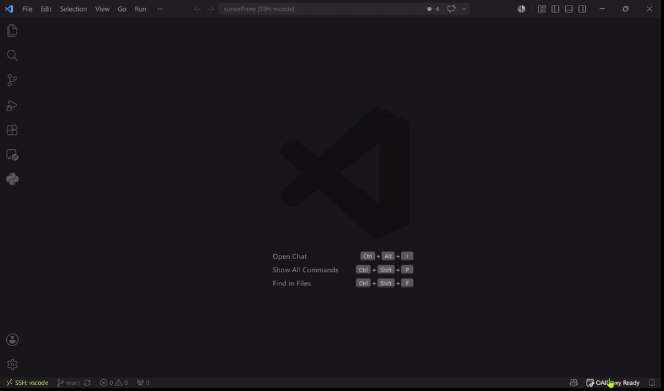

<div align="center">



# OAIProxy

**A self-maintained VS Code extension to use Azure Foundry/OpenAI/Ollama/Anthropic/Gemini API providers in GitHub Copilot Chat, with presets for Azure Foundry, OpenAI, TokenRouter, Anthropic, Fireworks, Kimi, DeepSeek, Z.AI GLM, Xiaomi MiMo, and MiniMax** 🔥

English | [简体中文](README.zh-CN.md)

</div>

[](https://github.com/lqdflying/OAIProxy/blob/main/LICENSE)





## Features
- **Multi-API support**: Azure Foundry/OpenAI/Ollama/Anthropic/Gemini APIs, with direct Azure Foundry presets plus OpenAI-compatible presets for Fireworks, Kimi, DeepSeek, Z.AI GLM, Xiaomi MiMo, MiniMax, ModelScope, SiliconFlow, and more
- **Vision models**: Full support for image understanding capabilities
- **Vision Bridge**: Use images in chat with text-only models — OAIProxy automatically describes images via a configured vision model with LRU caching
- **Think tag support**: Seamless display of model thinking/reasoning blocks across all providers (OpenAI, Ollama, Gemini, Anthropic)
- **Thinking Effort control**: VS Code's built-in per-model Thinking Effort dropdown in the model picker — customize reasoning effort on the fly
- **Advanced configuration**: Flexible chat request options with thinking/reasoning control
- **Multi-provider management**: Configure models from multiple providers simultaneously with automatic API key management
- **Model connection tests**: Test one configured model or run up to four tests in parallel from Model Management using the model's real saved request configuration
- **Provider usage checks**: Check xAI/Grok weekly subscription credit remaining, OpenAI Codex OAuth quota windows, Fireworks month-to-date serverless tokens, DeepSeek/Kimi credit balance, TokenRouter Management Key credit balance, MiniMax token-plan remaining quota, and OpenAI/Anthropic month-to-date cost usage from a standalone Provider Usage Check table; Azure Foundry, Z.AI, and MiMo explain where no public inference-key usage endpoint is available
- **Multi-config per model**: Define different settings for the same model (e.g., GLM-4.6 with/without thinking)
- **Visual configuration UI**: Intuitive interface for managing providers and models
- **Auto-retry**: Handles API errors (429, 500, 502, 503, 504) with exponential backoff
- **Request cancellation**: Stop in-progress chat requests instantly — cancellation is wired to HTTP `AbortController` across all API modes
- **Token usage**: Real-time token counting and provider API key management from status bar
- **Git integration**: Generate commit messages directly from source control with OpenAI/OpenAI Responses/Ollama/Anthropic models
- **Import/export**: Easily share and backup configurations
- **Tools optimization**: Optimize agent `read_file` tool handling for supported streamed tool calls, avoiding small chunks for large files.
- **Structured logging**: File-based request/debug logs with rotation, configurable levels (`off`/`debug`/`info`/`warn`/`error`)

## Requirements
- VS Code 1.120.0 or higher.
- OpenAI-compatible provider API key, or an eligible ChatGPT/Codex account for the OpenAI OAuth cards.

## Quick Start
1. Install the OAIProxy VSIX package (`lqdflying.oaiproxy`).
2. Open VS Code Settings and configure `oaicopilot.baseUrl` and `oaicopilot.models`.
3. Open GitHub Copilot Chat interface.
4. Click the model picker and select "Manage Models...".
5. Choose "OAIProxy" provider.
6. Enter your API key — it will be saved locally.
7. Select the models you want to add to the model picker.

> Compatibility note: OAIProxy keeps the existing `oaicopilot.*` settings keys, so your JSON model configuration stays valid. Because the extension ID changed to `lqdflying.oaiproxy`, VS Code may require entering API keys once under the new extension.

> [!IMPORTANT]
> **Configure a utility model when using OAIProxy/BYOK models in VS Code 1.128+.** VS Code leaves BYOK utility routing unconfigured by default, so Agent mode can report: `No utility model is configured for 'copilot-utility-small' while the selected main agent model is BYOK.` This is a VS Code routing message, not a Kimi K3 or OAIProxy request failure.
>
> Add the recommended option to your User Settings JSON:
>
> ```jsonc
> "chat.byokUtilityModelDefault": "copilot"
> ```
>
> - `"copilot"` (recommended when GitHub Copilot utility models are available) keeps OAIProxy/Kimi K3 as the main agent model while Copilot handles lightweight background tasks such as intent detection, chat titles, summaries, and commit messages.
> - `"mainAgent"` uses the currently selected OAIProxy/BYOK main model for those utility tasks too. Choose this when Copilot utility models are unavailable; it can send more requests to your provider and may be slower or cost more.
>
> Explicit `chat.utilityModel` or `chat.utilitySmallModel` selections take precedence over this default. See the [VS Code BYOK utility-model documentation](https://code.visualstudio.com/updates/v1_128#_configure-the-default-utility-model-for-byok).

### Settings Example

```json
"oaicopilot.baseUrl": "https://api-inference.modelscope.cn/v1",
"oaicopilot.models": [
    {
        "id": "Qwen/Qwen3-Coder-480B-A35B-Instruct",
        "owned_by": "modelscope",
        "context_length": 256000,
        "max_tokens": 8192
    }
]
```

Set `max_input_tokens` when a provider needs a safety margin below its official context window. OAIProxy advertises that smaller input budget to VS Code and blocks oversized requests before contacting the provider; it does not send `max_input_tokens` upstream.

## Configuration UI

The extension provides a visual configuration interface for managing providers, models, and API keys without editing JSON files manually. Open via the Command Palette (`OAIProxy: Open Configuration UI`) or click the OAIProxy status bar item.

The Provider Management form lists Azure Foundry first, followed by presets for OpenAI, TokenRouter, Anthropic, Fireworks, Kimi, DeepSeek, Z.AI GLM, Xiaomi MiMo, and MiniMax. For Azure Foundry, replace the resource-name placeholder with the direct `https://<resource>.services.ai.azure.com/openai/v1` endpoint and save its inference key; OAIProxy stores it as `oaicopilot.apiKey.azure-foundry` and authenticates with `api-key`. Quick Setup includes concise Azure Foundry cards for `Kimi-K2.6` and `DeepSeek-V4-Pro`. Selecting a preset fills the provider ID, base URL, and API mode; you can still fetch or enter model IDs from the provider's current model list. Example snippets are in `examples/openai-responses.jsonc`, `examples/openai-chat-completions.jsonc`, `examples/tokenrouter.jsonc`, `examples/anthropic.jsonc`, `examples/fireworks.jsonc`, `examples/zai-glm.jsonc`, `examples/mimo.jsonc`, `examples/minimax-openai.jsonc`, and `examples/minimax-anthropic.jsonc`.

Quick Setup also includes **Grok 4.7 (OAuth)** and **Grok 4.6 (OAuth)**. These cards use xAI's subscription Responses route at `https://cli-chat-proxy.grok.com/v1`; they do not require an API key. In the xAI provider row's **Actions**, click **Sign in**, complete the device-code approval in a browser, then add either card. The equivalent commands are **OAIProxy: Sign in to xAI / Grok with OAuth** and **OAIProxy: Sign out of xAI / Grok OAuth**. OAIProxy stores the refreshable credential in VS Code SecretStorage and refreshes it before requests. OAuth availability is controlled by xAI account eligibility; xAI API-key models remain available separately through `https://api.x.ai/v1`.

Quick Setup also includes **GPT-6 Astra/Sol/Luna** and **GPT-5.6 Sol/Terra/Luna (Codex OAuth)** cards. These use the separate `openai-oauth` provider at `https://chatgpt.com/backend-api/codex` and do not require an OpenAI API key. In the **OpenAI OAuth (Codex)** provider row's **Actions**, click **Sign in**; the device code stays visible in a modal with copy/open actions while you complete approval, then add a Codex card. The equivalent commands are **OAIProxy: Sign in to OpenAI / Codex with OAuth** and **OAIProxy: Sign out of OpenAI / Codex OAuth**. Credentials are stored in VS Code SecretStorage and refreshed before requests. OpenAI documents ChatGPT/Codex sign-in eligibility and plan-based usage separately from API-key billing; account availability can change.

Codex OAuth prompt caching has special request-affinity and Responses-body requirements. See the [OpenAI OAuth cache requirements](doc/openai-oauth-cache.md) lesson before changing this provider.

Model Management provides a per-model `Test` action and a parallel `Test all` action. Each test sends a small real inference request through the model's saved provider, API mode, headers, and advanced request settings, so it may incur minimal provider usage.

The standalone Provider Usage Check table lists configured supported providers dynamically and reports xAI/Grok weekly credit remaining, Codex OAuth quota windows, credit, token, token-plan, or cost usage. Codex quota uses the saved OAuth credential and OpenClaw-compatible `https://chatgpt.com/backend-api/wham/usage` bearer endpoint; it is best-effort compatibility support and may become unavailable if OpenAI changes that undocumented route. Fireworks account discovery and month-to-date serverless token checks reuse the normal Fireworks provider key. OpenAI and Anthropic usage/admin keys are stored separately from chat API keys. TokenRouter uses a separate Management Key and reports account credits from its Management API self-wallet endpoint. Azure Foundry inference keys cannot call an official usage/cost endpoint; use Azure Monitor or Cost Management with Azure RBAC. Z.AI and MiMo entries are likewise shown with unavailable reasons when their public docs do not expose API-key usage or balance endpoints.

→ [Full Configuration Guide](doc/configuration.md)

## Multi-API Mode

Supports seven API protocols: `azure-foundry` (direct Azure Foundry Chat Completions with `api-key` authentication), `openai` (Chat Completions), `litellm` (LiteLLM Proxy Chat Completions), `openai-responses` (Responses), `ollama`, `anthropic`, and `gemini`. Specify per-model via the `apiMode` parameter.

TokenRouter, Fireworks, Kimi, DeepSeek, Z.AI GLM, and Xiaomi MiMo use the existing `openai` mode because their hosted APIs are OpenAI-compatible. MiniMax supports both `openai` and `anthropic` modes; MiniMax recommends the Anthropic-compatible M3 endpoint for thinking and interleaved-thinking workflows.

→ [Full Multi-API Guide](doc/configuration.md#multi-api-mode)

## Azure Foundry

Azure Foundry uses its direct `/openai/v1` endpoint, not an Azure API Management gateway. Configure the resource URL and inference key in Provider Management, then add the `Kimi-K2.6` and/or `DeepSeek-V4-Pro` Quick Setup cards. The Kimi card defaults to `high` reasoning; DeepSeek defaults to `max`. Both cards support tools, and Kimi enables vision.

Azure Foundry performs eligible model prompt caching automatically. OAIProxy deliberately does not send `prompt_cache_key`, `prompt_cache_retention`, or `thinking` for these cards. A cache hit does not prevent the model from receiving the conversation context: Foundry reuses cached prefix computation internally while the model still processes the full logical request. Confirm real hits through `cache.usage` logs and `usage.prompt_tokens_details.cached_tokens`; caching is best effort, so identical requests can still report no hit.

## Fireworks AI

Fireworks is a first-class provider using `https://api.fireworks.ai/inference/v1` and full model IDs such as `accounts/fireworks/models/deepseek-v4-pro`, `accounts/fireworks/models/kimi-k2p7-code`, and `accounts/fireworks/models/glm-5p2`. Quick Setup keeps these Fireworks-hosted cards separate from the original DeepSeek, Kimi, and Z.AI cards.

Fireworks prompt caching is enabled by default upstream. OAIProxy adds a stable `user` affinity value to improve cache routing and reads cached-token telemetry from OpenAI-compatible usage responses. The Fireworks usage check discovers accounts through the public accounts API and reports month-to-date serverless input/output tokens; the HTTP endpoint does not expose rated cost totals.

## TokenRouter

TokenRouter is configured as an OpenAI-compatible provider at `https://api.tokenrouter.com/v1`. The Quick Setup cards use the exact gateway model IDs `deepseek/deepseek-v4-pro-0813`, `qwen/qwen3.8-max`, `moonshotai/kimi-k3`, and `z-ai/glm-5.3`; the provider key is stored separately as `oaicopilot.apiKey.tokenrouter`. TokenRouter credit checks use a separate Management Key stored as `oaicopilot.usageApiKey.tokenrouter` and call the Management API wallet endpoint.

## DeepSeek Flash

The direct DeepSeek Quick Setup card uses `deepseek-flash`, displayed as **DeepSeek Flash**, at `https://api.deepseek.com` in OpenAI Chat Completions mode. It enables vision, tools, and thinking with a 1M context window and `max_tokens: 393216` (384K). Thinking Effort offers `low`, `high`, and `max`, with `max` selected by default; reasoning history is forwarded for tool conversations, and prompt caching is managed by DeepSeek.

This card replaces the legacy Flash names `deepseek-v4-flash` and `deepseek-v4-flash-vision-exp` in Quick Setup. Existing saved models remain as configured. See the official [model details](https://api-docs.deepseek.com/quick_start/pricing), [Chat Completions API](https://api-docs.deepseek.com/api/create-chat-completion), and [vision guide](https://api-docs.deepseek.com/guides/vision).

## Z.AI GLM-5.3 and GLM-5.3-Flash

Quick Setup offers **GLM-5.3** (`glm-5.3`, text-only) and **GLM-5.3-Flash** (`glm-5.3-flash`, with vision) through the Z.AI GLM Coding Plan endpoint (`https://api.z.ai/api/coding/paas/v4`) in OpenAI Chat Completions mode. Both use a 1,000,000-token context window and `max_tokens: 131072`.

Both presets enable mandatory thinking and tools, offer `low`, `high`, and `max` Thinking Effort with `max` selected by default, and preserve reasoning history with `thinking.clear_thinking: false` and `include_reasoning_in_request: true`. They set `temperature: 1`, `top_p: 0.95`, and `extra.tool_stream: true` for streamed tool calls. Context caching is provider-managed.

These cards replace the direct Z.AI GLM-5.2 Quick Setup card; existing saved models remain as configured. See [GLM-5.3](https://docs.z.ai/guides/llm/glm-5.3), [GLM-5.3-Flash](https://docs.z.ai/guides/vlm/glm-5.3-flash), the [Coding Plan model guide](https://docs.z.ai/devpack/latest-model), and the [Chat Completions API](https://docs.z.ai/api-reference/llm/chat-completion). A complete configuration for both models is in `examples/zai-glm.jsonc`.

## MiniMax M3

Use `MiniMax-M3` as the model ID. MiniMax's M3 docs list a 1,000,000-token context window, tool use, coding/agentic workflows, adaptive thinking, and native image/video input. OAIProxy supports M3 through the existing MiniMax OpenAI-compatible preset (`https://api.minimax.io/v1`) and MiniMax Anthropic-compatible preset (`https://api.minimax.io/anthropic`).

For OpenAI mode, use `max_completion_tokens`, `thinking: { "type": "adaptive" }`, and `extra.reasoning_split: true` to stream thinking separately. For Anthropic mode, use `max_tokens` and `thinking: { "type": "adaptive" }`. Set `vision: true` for M3 so OAIProxy forwards image and supported video `LanguageModelDataPart`s directly instead of routing image inputs through Vision Bridge.

## Vision Bridge

Use images with text-only models. OAIProxy automatically describes images via a configured vision-capable model before forwarding as text, with LRU caching (50 entries, ~500KB).

→ [Vision Bridge Guide](doc/vision-bridge.md)

## Multi-Provider Guide

Configure models from multiple providers simultaneously. Use `owned_by` to group models by provider, with automatic per-provider API key management stored as `oaicopilot.apiKey.<provider>`.

→ [Multi-Provider Guide](doc/configuration.md#multi-provider-guide)

## Multi-config for the same model

Define multiple configurations for the same model ID via `configId` (e.g., `glm-4.6::thinking` and `glm-4.6::no-thinking`), each with independent settings.

→ [Multi-config Guide](doc/configuration.md#multi-config-for-the-same-model)

## Thinking Effort Control

VS Code 1.120+ exposes a per-model Thinking Effort dropdown in the model picker. Enable it with `supports_reasoning_effort: true`. The direct DeepSeek Flash card offers `low`/`high`/`max` and defaults to `max`; legacy DeepSeek presets use `high`/`max`. Claude Sonnet 4.6 is detected automatically and maps to Anthropic `output_config.effort`.

→ [Thinking Effort Guide](doc/thinking-effort.md)

## Custom Headers

Specify custom HTTP headers per model provider (API versioning, additional auth, debugging tokens). Merged with default headers on each request.

→ [Custom Headers Guide](doc/custom-headers.md)

## Custom Request Body Parameters

Use the `extra` field to inject arbitrary JSON parameters into the API request body for all API modes. Override standard parameters or add provider-specific features.

→ [Custom Request Body Guide](doc/custom-request-body.md)

## Prompt / KV Cache

OAIProxy surfaces provider cache-hit usage in structured logs and applies safe cache request shaping where supported. OpenAI endpoints get a stable `prompt_cache_key` by default, Fireworks gets a stable `user` affinity value, and Anthropic-compatible `cache_control` writes are opt-in via `prompt_cache.anthropic.enabled` or explicit VS Code `cache_control` message parts. Azure Foundry, DeepSeek, Xiaomi MiMo, MiniMax OpenAI mode, and Gemini continue to use provider automatic/implicit caching.

OpenAI `previous_response_id` is kept for conversation state only; OpenAI still bills previous input tokens in the response chain. Use `oaicopilot.logLevel: "info"` or `"debug"` and inspect `cache.usage` log entries to verify actual cache reads/hits.

## Model Parameters

Full reference of all 30+ configurable model parameters (`id`, `owned_by`, `temperature`, `reasoning_effort`, `vision`, `toolCalling`, `apiMode`, etc.).

→ [Model Parameters Reference](doc/model-parameters.md)

## Logging

OAIProxy always writes extension lifecycle events (install, update, activate) to the VS Code Output panel. Open `Output: Show Output` and select `OAIProxy`.

For request/debug logs, add this to VS Code User Settings JSON:

```json
"oaicopilot.logLevel": "debug"
```

Valid values are `off`, `debug`, `info`, `warn`, and `error`. File logs are written to `~/.copilot/oaiproxy/logs/` with daily rotation (logs older than 7 days are automatically cleaned up). Sensitive header values (`Authorization`, `x-api-key`, `x-goog-api-key`) are automatically redacted from log output.

## Thanks to

Thanks to all the people who contribute.

- [Contributors](https://github.com/lqdflying/OAIProxy/graphs/contributors)
- [Hugging Face Chat Extension](https://github.com/huggingface/huggingface-vscode-chat)
- [VS Code Chat Provider API](https://code.visualstudio.com/api/extension-guides/ai/language-model-chat-provider)

## Support & License
- Open issues: https://github.com/lqdflying/OAIProxy/issues
- License: MIT.
- Original upstream copyright (c) 2025 Johnny Zhao; OAIProxy changes copyright (c) 2026 lqdflying.
